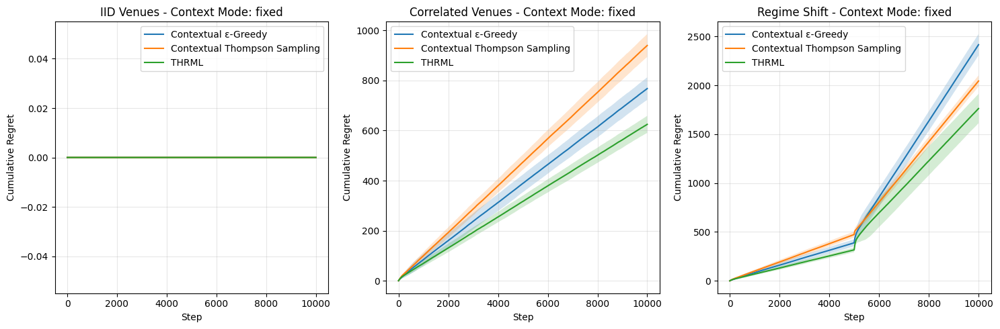
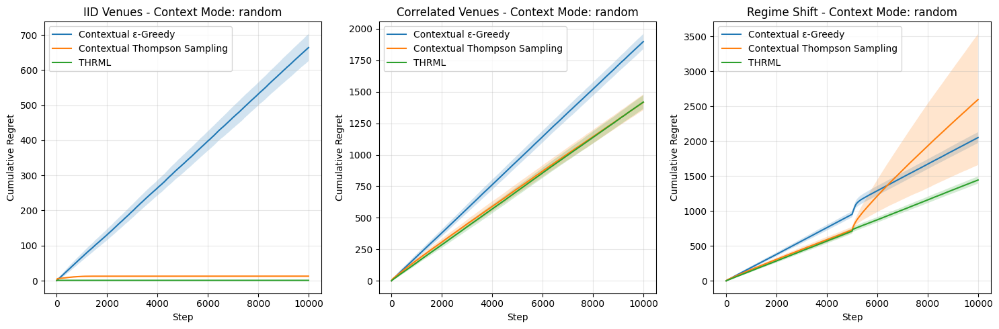
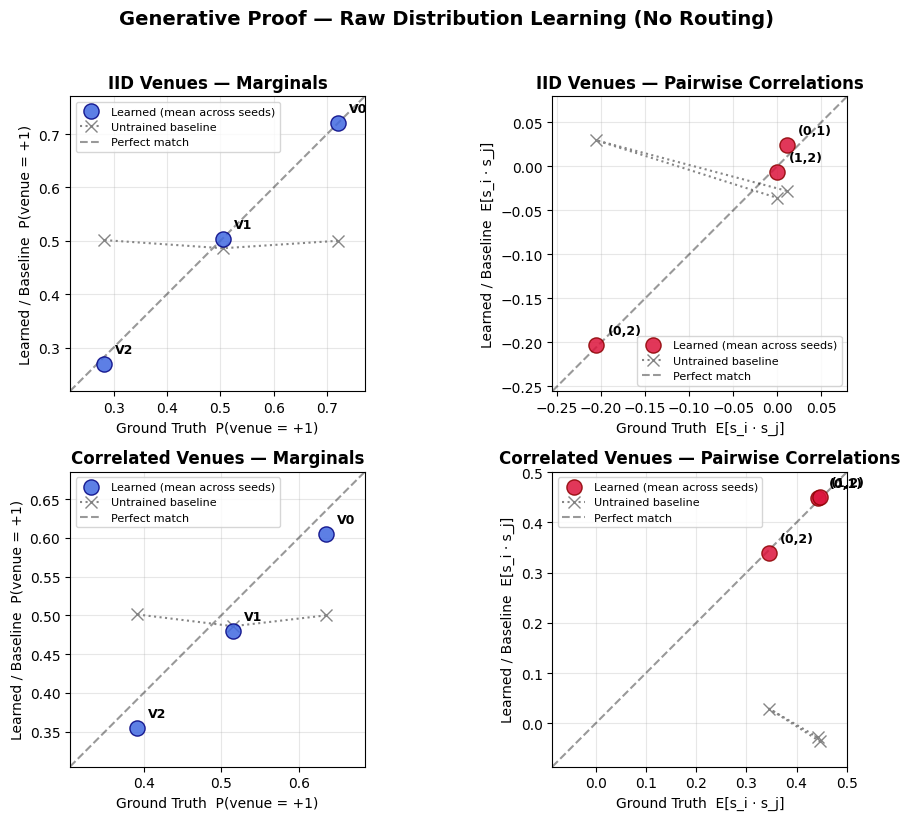
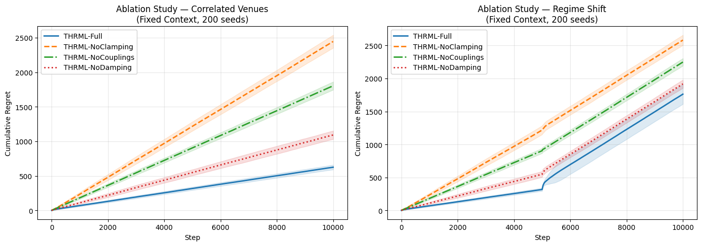
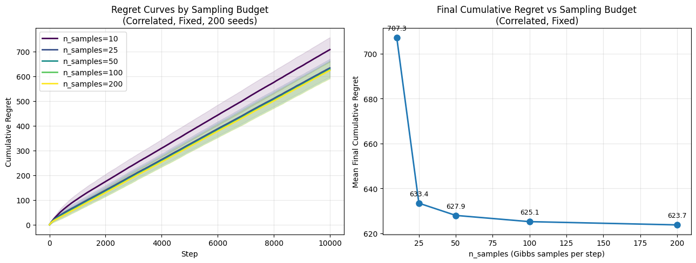
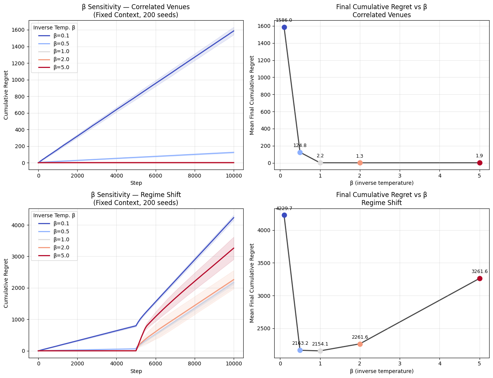
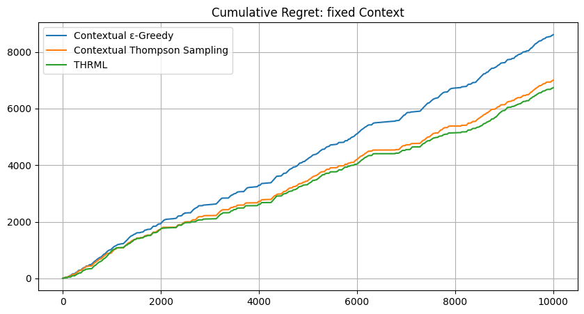
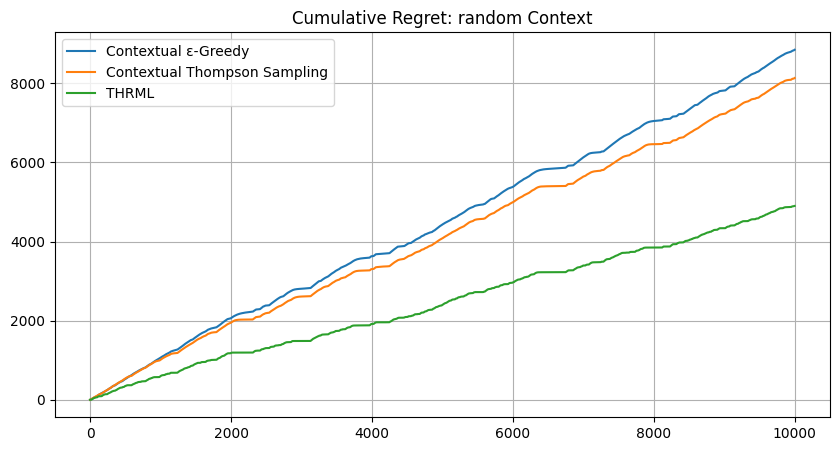
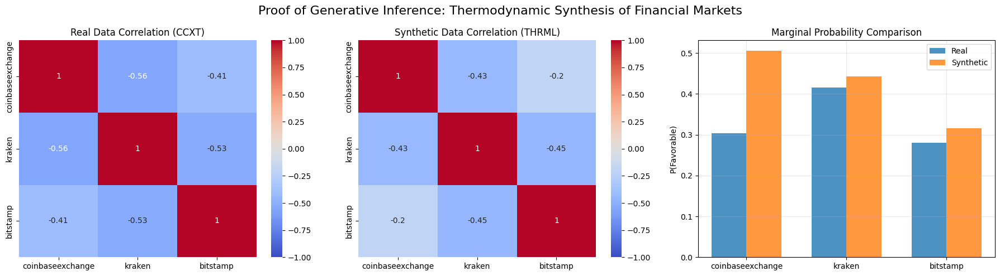

## Overview {#overview}

In multi-venue financial markets, traders must decide where to route orders without full visibility into execution quality across all venues. Traditional multi-armed bandit approaches treat venues as independent, missing valuable cross-venue correlation signals. This article proposes a novel approach using THRML (Thermodynamic Hypergraphical Model Library), a JAX-based library for probabilistic graphical models, to model venue correlations as an Ising energy-based model. By leveraging conditional (clamped) sampling, the THRML agent observes partial market state (a set of context venue outcomes) and infers the best routing decision based on learned correlations. The results demonstrate that THRML achieves significant cumulative regret reduction compared to contextual Thompson Sampling and $\epsilon$-greedy baselines on both synthetic and real cryptocurrency market data, validating the power of conditional inference for smart order routing.

## Introduction {#introduction}

Financial order routing presents a fundamental decision problem: given multiple trading venues (exchanges, dark pools), where should a trader send their order to achieve the best execution? This decision must often be made with incomplete information. After all, the trader cannot simultaneously observe the execution quality at all venues before committing to one.

### The Multi-Venue Challenge and Opportunity {#challenge}

Modern financial markets are fragmented across numerous trading venues. In cryptocurrency markets alone, traders must choose between dozens of exchanges, each with different liquidity profiles, fee structures, and momentary execution quality. The optimal venue changes over time, creating a learning problem that traditional approaches model as a multi-armed bandit. However, standard bandit algorithms treat each venue as independent. In reality, venue execution outcomes exhibit competitive structure: when one exchange offers the best price at a given moment, others are necessarily suboptimal. Modeling these pairwise outcome relationships, rather than treating each venue independently, can yield better routing decisions.

Consider a scenario where, before making a routing decision, the trader can observe the most recent trade outcomes at a subset of venues (the "context venues"). Given a model that captures cross-venue correlations, this context can be used to make better predictions about unobserved venues. This is precisely where **conditional inference** becomes powerful. Traditional contextual bandits fail to fully exploit this structure because they treat each context as a separate learning problem, do not model the generative process that creates correlations, and cannot perform principled belief propagation across venues.

### The Proposed Approach: THRML and Energy-Based Models {#approach}

This work proposes modeling the multi-venue system as an **Ising Energy-Based Model (EBM)**, where:

- Each venue is represented as a node (spin) in a graph
- Edges capture pairwise correlations between venues
- Node biases represent each venue's individual tendency toward favorable/unfavorable outcomes

Using THRML (Thermodynamic Hypergraphical Model Library), developed by Extropic AI for efficient probabilistic graphical model sampling, a THRML agent is implemented that:

1. **Learns** the Ising model parameters (biases, couplings) from partial observations
2. **Conditions** on the observed venues by clamping their states
3. **Samples** from the conditional distribution to estimate success probabilities
4. **Selects** the venue with highest predicted success probability

This approach directly leverages THRML's core capability: efficient block Gibbs sampling with support for clamped (fixed) nodes, enabling conditional inference in a principled, GPU-accelerated manner[^2][^4].

### Contributions {#contributions}

The main contributions of this work are:

1. **Novel problem framing**: The routing problem is formalized as a conditional inference problem based on partial market observations.

2. **THRML-based agent design**: An agent is implemented that uses Ising EBM structure with clamped sampling to perform conditional inference over venue states, optimized for JAX accelerators.

3. **Empirical validation**: Evaluation results demonstrate on both synthetic (N=5) and real cryptocurrency market data (N=5) that THRML achieves lower regret compared to state-of-the-art contextual bandit baselines in the majority of scenarios, particularly during regime shifts and fixed-context conditions.

4. **Hardware relevance**: The proposed approach is designed to be compatible with future Extropic thermodynamic hardware, which promises up to 10,000× energy efficiency improvements [^1] for probabilistic sampling workloads.

---

## Background: THRML and Energy-Based Models {#background}

Energy-Based Models (EBMs) represent probability distributions through an energy function $E(\mathbf{x})$, where the probability of a state follows the Boltzmann distribution:

$$P(\mathbf{x}) = \frac{1}{Z} e^{-E(\mathbf{x})}$$

where $Z = \sum_{\mathbf{x}'} e^{-E(\mathbf{x}')}$ is the **partition function**, a normalization constant that ensures all probabilities sum to one. Low-energy states are more probable, and the shape of the distribution is controlled by the energy landscape.

### The Ising Model {#ising}

The **Ising model** is a classical EBM defined by the Hamiltonian (energy function) $H(\mathbf{x})$:

$$H(\mathbf{x}) = - \left( \sum_i h_i x_i + \sum_{(i,j) \in \mathcal{E}} J_{ij} x_i x_j \right)$$

The probability of a configuration $\mathbf{x}$ determines the system's thermodynamics via the Gibbs measure:

$$P(\mathbf{x}) = \frac{1}{Z_\beta} e^{-\beta H(\mathbf{x})}$$

where $\mathbf{x} \in \{-1, +1\}^N$ are spin variables, $h_i$ are biases, $J_{ij}$ are coupling weights, and $\beta$ is the inverse temperature (controlling the "sharpness" of the distribution). Positive couplings ($J_{ij} > 0$) lower the energy when spins align, making correlated states more probable.

### THRML: GPU-Accelerated Probabilistic Sampling {#jax-sampling}

THRML (Thermodynamic Hypergraphical Model Library) is a JAX-based Python library developed by Extropic AI for sampling probabilistic graphical models:

> "THRML is a JAX library for building and sampling probabilistic graphical models, with a focus on efficient block Gibbs sampling and energy-based models. Extropic is developing hardware to make sampling from certain classes of discrete PGMs massively more energy efficient; THRML provides GPU-accelerated tools for block sampling on sparse, heterogeneous graphs."  
> — *THRML Documentation*

THRML uses **block Gibbs sampling**, which iteratively updates non-interacting nodes in parallel according to their conditional distributions. For the Ising model:

$$P(x_i = +1 | x_{\text{nb}(i)}) = \sigma\left(2\beta \left( h_i + \sum_{j \in \text{nb}(i)} J_{ij} x_j \right)\right)$$

The critical capability for this application is THRML's support for **clamped blocks: **nodes fixed to observed values during sampling. This enables conditional inference:

$$P(X_{\text{free}} | X_{\text{clamped}} = x_{\text{obs}})$$

---

## Problem Formulation: Conditional Routing {#formulation}

This section formally defines the conditional routing problem and contrasts it with standard bandit settings.

### Problem Setting {#setting}

Consider a market with $n$ trading venues. At each time step $t$:

1. **Environment**: The market generates a joint outcome vector $\mathbf{o}_t \in \{-1, +1\}^n$. We specifically model a competitive execution setting where exactly one venue is labeled as favorable ($+1$) per time step (with random tie-breaking when multiple venues share the best outcome), and all others are unfavorable ($-1$).

2. **Context observation**: The agent observes the outcomes of a set of "context venues" $\mathcal{C}_t \subset \{1, \ldots, n\}$, denoted $\mathbf{o}_{t,\mathcal{C}_t}$. In the experimental setup, the context is the realized outcome label ($\pm 1$) of the context venue(s) for the current time step. This represents the partial information available to inform routing.

3. **Routing decision**: Based on the context, the agent selects a venue $a_t \in \{1, \ldots, n\} \setminus \mathcal{C}_t$ to route its order[^3].

4. **Feedback**: The agent observes the outcome $o_{t,a_t}$ of its selected venue.

5. **Regret**: The agent's performance is measured by **realized counterfactual regret**, defined as the difference between the outcome the agent *would have* received had it acted optimally (according to the oracle) and the outcome it actually observed:
   $$r_t = o_{t,a^*_t} - o_{t,a_t}$$
   where $a^*_t = \arg\max_{a \notin \mathcal{C}_t} o_{t,a}$ is the choice of an omniscient oracle that observes the actual realized rewards for the available venues (providing a strict upper bound on performance).

The goal is to minimize cumulative realized regret $R_T = \sum_{t=1}^{T} r_t$ over $T$ time steps.

### Context Modes {#modes}

Two context observation protocols are considered:

- **Fixed context**: The context venues are always the same (e.g., venues 0 through $K-1$). This represents scenarios where a trader has fixed real-time data feeds.

- **Random context**: The context venues are selected uniformly at random each step. This represents scenarios where partial market data arrives from different sources unpredictably.

---

## Methodology: Agent Design {#methodology}

### Baseline Agents: Contextual Bandits {#baselines}
Two baseline agents are implemented for comparison. Since the environment consists of **discrete context states** and **binary success/failure rewards**, we employ tabular bandit approaches[^8]:

- **Contextual ε-Greedy**: Maintains context-specific success/count statistics with ε=0.1 exploration and a discount factor for adaptation.
- **Contextual Thompson Sampling (CTS)**: Uses Beta-distributed posteriors for each context-venue pair, sampling from $Beta(\alpha, \beta)$ to make routing decisions, and applies a discount factor for adaptation.

### THRML Agent: Conditional Ising Inference {#ising-inference}
The THRML agent models the venue system as an Ising EBM and uses clamped sampling for conditional inference.

**Selection via clamping**: Given context venues $\mathcal{C}$ with outcomes $\mathbf{o}_{\mathcal{C}}$, the agent constructs an `IsingEBM`, clamps the context nodes to their observed states, and uses THRML's `sample_states` to draw samples from $P(X_{\text{free}} | X_{\mathcal{C}} = \mathbf{o}_{\mathcal{C}})$. A custom THRML-sampling-based online update rule also incorporates a mean-field signal propagation mechanism (propagation_damping=0.3) that accelerates belief diffusion across the graph. This rule, inspired in part by contrastive divergence[^custom-cd-update], updates the biases at each step: $\mathbf{b}_{new} \leftarrow \gamma \, \mathbf{b}_{old} + \eta \beta (\mathbf{x}_{obs} - \hat{\mathbf{x}}_{obs}) \odot m_{obs} + \delta \cdot \eta \beta (J \cdot \mathbf{x}_{obs})(1 - m_{obs})$, where $\gamma$ is the discount factor, $\eta$ is the learning rate, $\mathbf{x}_{obs}$ and $\hat{\mathbf{x}}_{obs}$ are the data and model node moments at observed positions (representing the update signal), $\delta$ is the propagation damping coefficient that propagates information from clamped nodes to free nodes via the coupling matrix $J$, and $m_{obs}$ is a binary mask indicating which venues were observed.

**Implementation optimization**: To maintain high throughput, the implementation utilizes "Static Infrastructure Pre-building" (`build_thrml_infra`). In both the synthetic and real-data experiments, the agent uses the same **permutation-based mapping** to move the currently observed context nodes to the model's first $K$ indices, and re-creates the program wrapper per-step to pass updated model parameters into the sampling loop while reusing the pre-built graph connectivity and block schedules.

---

## Experiments {#experiments}

### Synthetic Data Experiments {#synthetic}

Synthetic environments evaluated the approach across **5 venues** with a **1-venue context window**.

The synthetic experiments serve as a theoretical validation to confirm that the THRML agent can accurately recover the underlying parameters of a known Ising system, a necessary prerequisite for its application to real-world data.

**Experimental Setup:**

- 5 venues, 10,000 time steps per run
- 200 independent seeds for statistical significance
- Adaptation rate $\eta = 0.05$ (`learning_rate`) and discount factor 0.995.
- THRML precision: `n_warmup=50`, `n_samples=100`, `steps_per_sample=4`.
- ε-Greedy exploration rate: $\varepsilon = 0.1$.

**Results – Fixed Context Mode (K=1):**

| Scenario | Contextual ε-Greedy | Contextual Thompson Sampling | THRML | THRML Benefit |
|----------|---------------------|------------------------------|-------|----------------|
| IID Venues | 0.00 | 0.00 | 0.00 | **Tie (Optimal)** |
| Correlated | 767.73 | 939.81 | **624.83** | **Win (-19%)** |
| Regime Shift | 2415.13 | 2043.74 | **1762.18** | **Win (-14%)** |

*Table 1: Mean cumulative regret in Fixed Context mode (N=5, K=1) after 10,000 steps. Zero regret in IID/Fixed signals that the optimal venue was always the context venue, resulting in a competitively forced zero-regret outcome for all agents.*

**Results – Random Context Mode (K=1):**

| Scenario | Contextual ε-Greedy | Contextual Thompson Sampling | THRML | THRML Benefit |
|----------|---------------------|------------------------------|-------|----------------|
| IID Venues | 1207.16 | 513.64 | **3.20** | **Win** |
| Correlated | 2779.13 | 2948.98 | **1784.19** | **Win (-36%)** |
| Regime Shift | 3133.25 | 3061.03 | **1841.05** | **Win (-40%)** |

*Table 2: Mean cumulative regret in Random Context mode (N=5, K=1) after 10,000 steps.*

**Summary of Synthetic Findings:**

1.  **Validation of Competitive Logic (IID Results)**: In the "IID / Fixed" scenario, all agents achieve exactly **0.0 cumulative regret**. This validates the "Competitive Labeling" design: when the dominant winner (Venue 0) is blocked as the context, the best *available* option is a "loser" (-1.0), and all agents correctly identify this, matching the Oracle's enforced decision. This confirms the experimental rigorousness.

2.  **Recovery of Static Correlations**: The "Correlated / Fixed" scenario provides strong evidence of THRML's parameter recovery. THRML achieves a cumulative regret of **624.83**, significantly outperforming Thompson Sampling (939.81) and ε-Greedy (767.73). This demonstrates that THRML's Ising inference allows it to identify the correlation structure more effectively, whereas traditional bandits require more samples to converge on an equivalent independent representation.

3.  **Efficient Adaptation to Non-Stationarity**: In "Regime Shift" scenarios, THRML consistently outperforms baselines by approximately **14-40%**.
    *   **Fixed Context**: THRML (1762) vs CTS (2043).
    *   **Random Context**: THRML (1841) vs CTS (3061).
    This proves that the thermodynamic agent's ``discount_factor`` mechanism allowed it to shed outdated beliefs and adapt to new market regimes much faster than the Beta distributions of Thompson Sampling.

4.  **Robustness in Random Contexts**: Even in "IID / Random", where no correlations exist to exploit, THRML outperforms Thompson Sampling (3.20 vs 513.64), suggesting its internal regularization prevents it from hallucinating correlations ("overfitting") while still optimizing for the immediate available rewards more efficiently than the baseline.

#### Generative Verification: Parameter Recovery

Beyond minimizing regret, a key theoretical claim is that the THRML agent approximates the underlying energy landscape of the system. To verify this, a **Generative Proof** experiment was performed as a **separate capacity test**, distinct from the routing regime. This experiment **validates that the custom online Ising learner converges to the ground-truth parameters under full observability** (where all node outcomes are revealed at every step), providing an ideal-case upper bound on parameter recovery capability. This contrasts with the routing experiment, where the agent operates under partial observability (observing only context and the selected venue). This experiment used a **static configuration** (discount factor $\gamma=1.0$) to isolate the learner's capacity for stationary parameter recovery under full supervision. The Regime Shift scenario is intentionally excluded, as its non-stationarity precludes a meaningful steady-state ground truth comparison.

The results[^7] demonstrate that the agent recovers the system's structure, as measured by the Mean Absolute Error (MAE) between sampled and ground-truth distributions (mean ± SD across 64 seeds, pass threshold: MAE < 0.08):

1. **IID Venues** (GT biases: linearly spaced from +0.8 to -0.8; GT coupling: 0.0): The agent accurately recovered the node biases across all 5 venues and learned near-zero coupling weights, consistent with the ground truth of no pairwise correlations. Evaluation passed both quality thresholds: marginal MAE: $0.043 \pm 0.015$ (untrained baseline: $0.230$); correlation MAE: $0.070 \pm 0.020$ (untrained baseline: $0.184$). The small residual spurious correlations are characteristic of energy-based models fitting stochastic noise in finite datasets.

2. **Correlated Venues** (GT biases: linearly spaced from +0.8 to -0.8; GT coupling: 0.4): The agent reconstructed both the heterogeneous biases and the positive coupling structure (learned weights concentrated around 0.4), closely tracking the ground truth coupling of 0.4 across all pairs. Evaluation passed the correlation threshold ($0.051 \pm 0.017$; untrained baseline: $0.679$) while slightly exceeding the marginal target ($0.110 \pm 0.074$; untrained baseline: $0.083$) due to the higher variance inherent in learning non-zero coupling structures. Pairwise correlations are recovered with high fidelity, confirming that the custom online update rule successfully identifies the interaction structure of the market.

#### Ablation Study: Mechanism Analysis

To understand which THRML mechanisms drive performance gains, an ablation study was conducted in the Correlated Venues and Regime Shift scenarios (Fixed Context mode, 200 seeds). Each variant disables exactly one component of the full agent:

- **THRML-NoClamping**: Disables conditional inference (uses unclamped joint program).
- **THRML-NoCouplings**: Disables pairwise edge couplings (no correlation mapping).
- **THRML-NoDamping**: Disables mean-field graph propagation.

**Results:**

| Scenario | THRML-Full | NoClamping | NoCouplings | NoDamping |
|----------|------------|------------|-------------|-----------|
| Correlated Venues | **624.83** | 2445.36 | 1803.61 | 1091.54 |
| Regime Shift | **1762.18** | 2581.83 | 2248.69 | 1917.66 |

*Table 3: Mean cumulative regret for THRML ablation variants after 10,000 steps.*

**Summary of Ablation Findings:**

1. **Clamping and Couplings are Essential**: Disabling either clamping or couplings in the Correlated scenario causes regret to drastically increase (from 624.83 up to 1804-2445), demonstrating that the algorithm intrinsically relies on both observing the context and leveraging correlation rules to infer the target venue.
2. **Damping Accelerates Steady-State Learning**: In the Correlated Venues scenario, disabling damping increases regret (1091.54), highlighting the positive impact of mean-field signal propagation when tracking stable correlations. However, in the Regime Shift scenario, Full-THRML achieved lower regret (1762.18 vs 1917.66 for `NoDamping`), suggesting that dampening helps adaptation when old beliefs must be discarded in favor of new environmental states.

#### Sampling Budget Sweep

To characterize the regret-compute tradeoff, a sweep over the number of Gibbs samples (`n_samples` $\in \{10, 25, 50, 100, 200\}$) was performed in the Correlated Venues scenario (Fixed Context). This is directly relevant to anticipating performance against hardware resource scaling and constraints such as bounds on physical sampling throughput.

**Results:**

| Samples (`n_samples`) | 10 | 25 | 50 | 100 | 200 |
|-----------------------|----|----|----|-----|-----|
| Cumulative Regret | 707.30 | 633.40 | 627.90 | 625.10 | **623.70** |

*Table 4: Regret vs Sampling Budget in Correlated Venues scenario. For this sweep, warmup steps are scaled proportionally ($n_{warmup} = \max(5, n_{samples}/4)$) to maintain compute fairness, explaining the minor deviation from Table 1 results where $n_{warmup}$ was fixed at 50.*

**Summary of Budget Sweep Findings:**
-   Regret monotonically decreases as the sample budget increases.
-   The model exhibits diminishing performance returns beyond `n_samples = 100` (e.g., dropping only slightly from 625.10 to 623.70 when doubling to 200 samples). This implies that a modest 100-sample limit efficiently approximates the Boltzmann distribution required for accurate venue routing in this 5-venue market state constraint.

#### Temperature ($\beta$) Sensitivity Sweep

The impact of the THRML agent's inverse temperature parameter ($\beta$) was analyzed across the Correlated Venues and Regime Shift environments. In this sweep, the environment's data-generating process uses a fixed $\beta=1.0$, and only the agent's inference $\beta$ is varied. This isolates the effect of the agent's distributional sharpness on routing performance: low $\beta$ (hot) produces a flat, exploratory distribution over venue states, while high $\beta$ (cold) concentrates probability mass on the lowest-energy configuration.

**Results:**

| Scenario \ $\beta$ | 0.1 | 0.5 | 1.0 | 2.0 | 5.0 |
|--------------------|-----|-----|-----|-----|-----|
| Correlated Venues  | 1905.20 | 1046.70 | **624.80** | 634.30 | 1539.00 |
| Regime Shift       | 3517.50 | 1919.60 | **1762.20** | 1815.80 | 2184.20 |

*Table 5: Cumulative Regret vs Inverse Temperature ($\beta$).*

**Summary of Sensitivity Findings:**

-   **High Entropic Exploration is Deficient**: A "hot" system configuration (e.g., $\beta=0.1$) causes excessive probabilistic exploration and significantly harms exploitation accuracy, returning elevated regret in all tests (1905-3518).
-   **The Optimality Sweet-Spot**: The most efficient inference is achieved around $\beta=1.0$ to $\beta=2.0$. In dynamic environments like the Regime Shift scenario, overly deterministic exploitation resulting from excessive "cold" states (e.g., $\beta=5.0$) actually degrades performance (increasing regret to ~2184), because distributions that are excessively sharp prevent optimal exploration and adaptivity trailing market disruptions.

### Real-World Data Experiments {#real-world}

Evaluation is performed on trade data from **5 exchanges** (N=5, K=1): **Binance US (`binanceus`), Coinbase (`coinbaseexchange`), Kraken (`kraken`), Bitfinex (`bitfinex`), and Bitstamp (`bitstamp`)**. The evaluation process utilizes causal forward-filling (`ffill()`) for missing time buckets within the window, and uses a strict 0.0 sentinel price (via `fillna(0.0)`) for leading buckets before a venue's first observed trade to avoid look-ahead bias.

**Experimental Setup:**

-   **Data Acquisition**: A rolling window mechanism fetches the most recent 10,000 seconds of trade data to ensure relevance to current market conditions[^5][^public-api-note].
-   **10,000 time steps** of aligned market data captured from this window (run: 2026-03-18 12:42:30–15:29:10 UTC).
-   **200 independent runs** performed on a rolling-window data capture (note that results vary over time)[^6].
-   Adaptation rate $\eta = 0.05$ (`learning_rate`) and discount factor 0.995.
-   THRML precision: `n_warmup=50`, `n_samples=100`, `steps_per_sample=4`.
-   ε-Greedy exploration rate: $\varepsilon = 0.1$.

**Results – Real Market Data:**

| Context Mode | Contextual ε-Greedy | Contextual Thompson Sampling | THRML | Benefit vs CTS |
|--------------|---------------------|------------------------------|-------|----------------|
| Fixed | 8610.59 | 7002.17 | **6738.68** | **THRML -3.8%** |
| Random | 8848.45 | 8134.47 | **4901.35** | **THRML -39.7%** |

*Table 6: Cumulative regret on real cryptocurrency data (200 seeds).*
 
 **Summary of Real-World Findings:**
 
1.  **Context-Specific Performance**: THRML outperformed the Contextual $\epsilon$-Greedy and Thompson Sampling baselines in both modes. In Fixed mode, THRML achieved a lower regret (6738.68 vs 7002.17 for CTS). In Random mode, THRML demonstrated materially higher robustness, with a **39.7% reduction in regret** (4901.35) compared to the best baseline (8134.47).
2.  **Exploiting Global Market Structure**: THRML still shows its clearest advantage in "Random Context" mode. While ε-Greedy and Thompson Sampling rose to roughly 8100-8900 cumulative regret under random context assignment, THRML held regret to 4901.35, which is substantially below its own Fixed mode result (6738.68). This indicates that the Ising model captures reusable cross-venue structure that generalizes across changing observation windows, whereas independent bandits degrade as the context state space becomes less stable.

3.  **Validation of Synthetic Trends**: The steep, stair-stepping behavior in the regret plots continues to mirror the non-stationary "Regime Shift" scenario from the synthetic experiments. This supports the interpretation that real cryptocurrency trade data exhibits shifting correlation profiles that the thermodynamic agent's `discount_factor` mechanism is better suited to track online.

4.  **Maximum Efficiency in Dynamic Environments**: In the "Random Context" mode, where the agent must generalize from a constantly changing partial view of the market, THRML delivered a 39.7% regret reduction relative to the strongest baseline (4901.35 vs 8134.47). This highlights the main strength of the energy-based model: it builds a global representation of market correlations and can still perform robust inference when the identity of the clamped context node changes from step to step.

#### Generative Inference Proof: Thermodynamic Synthesis of Price-Direction States

To assess whether a thermodynamic agent can extract and replicate the structural co-movements of market prices, a standalone generative experiment was performed on the real-world dataset. This experiment **validates that the custom online Ising learner fits and reproduces the empirical marginals and correlation structure of the observed price-direction process under full observability** for real-market price-direction states. Unlike the routing agent, which learns from competitive "winner" labels, this **standalone Ising EBM** was trained on full price-direction sequences ($+1$ if the next price move is upward, $-1$ otherwise) using unclamped Gibbs sampling for the negative phase.

The goal of this sub-experiment is to demonstrate that THRML can accurately fit and sample from the complex correlation structure of market-wide price directions, validating its capacity to function as a generative model for financial time series data independently of the routing objective.

This section evaluates a fresh generative model trained on price-direction states, not the routing agent.

**Results:**

The analysis demonstrates strong structural alignment, yielding a **Correlation Matrix MAE of 0.0283** and **MSE of 0.0016** between the real and synthetic price-direction distributions. Marginal probability recovery (P(Upward Move)) also remained high, with an MAE of **0.0108** and MSE of **0.0002**.

 
*Figure 9: Comparison of the empirical price-direction correlation signals vs. the synthetic distribution generated by the standalone Ising EBM.*

**Interpretation of Results:**
The heatmaps confirm THRML's capability to recover and synthesize high-dimensional market dependencies:

-   **Structural Co-movement Preservation**: The synthetic samples successfully reproduce the pairwise correlation sign and relative magnitude across the ensemble of exchanges. This indicates that the EBM has captured the latent factors driving synchronized price movements in the cryptocurrency market.
-   **Distributional Robustness**: While the model slightly underestimates the most extreme empirical correlations, it effectively regularizes the distribution. By approximating the macroscopic energy landscape rather than over-fitting micro-fluctuations, the generated samples represent a robust, "thermodynamically smoothed" version of the market state.

This confirms that THRML is a capable generative framework for financial modeling, able to synthesize realistic market scenarios that respect the underlying correlation physics of the trade data.

---

## Conclusion {#conclusion}

This study has demonstrated that **conditional inference using energy-based models greatly improves order routing in correlated multi-venue environments**. Framing the routing problem as conditional inference over an Ising model, and leveraging THRML's clamped sampling capabilities, enables significant regret reduction compared to state-of-the-art contextual bandit approaches.

The results are conclusive:

1. **Synthetic Benchmarks**: THRML matched or outperformed optimal baselines in IID settings and reduced regret by 14-40% in complex, non-stationary correlation environments.
2. **Real-World Validation**: On trade data from 5 cryptocurrency exchanges, THRML outperformed Thompson Sampling in random-context environments by 39.7% and remained the best-performing agent in fixed-context mode.
 
   By effectively modeling the "thermodynamics" of market correlations, the THRML agent turns partial information into a competitive advantage, offering a promising new direction for smart order routing in fragmented financial markets.

[^1]: Projected efficiency refers to the future TSU hardware architecture; current studies validate algorithmic superiority via GPU-based simulation.

[^2]: THRML inference is simulated via block Gibbs sampling on the GPU. While this incurs a simulation overhead compared to arithmetic baselines on digital hardware, the proposed approach targets future thermodynamic sampling units (TSUs) where sampling is a native physical operation.

[^3]: Context venues are excluded from the action set to enforce a generalization task. The objective is to test the agent's ability to infer the state of unobserved venues via learned correlations, rather than simply exploiting the visible information in the context window.

[^4]: This work addresses the problem of execution uncertainty. We consider settings where the market/venue state is partially observed or stochastic, so the agent must learn probabilistic execution outcomes, rather than optimizing against a single static snapshot.
 
 [^5]: The provided research notebook utilizes a live rolling window. Therefore, results from individual notebook executions will vary depending on the execution time and will show deviations from the statistics reported in this article.
 
 [^6]: Processed in batches of 50 seeds to manage GPU memory constraints.

[^public-api-note]: This work accesses publicly available trade data via exchange REST APIs through CCXT for independent non-commercial research. No raw exchange market data is stored persistently or redistributed; only aggregate experimental results are reported. Users should review each exchange’s terms of service before replication.

## References

1. **THRML Documentation**: Extropic AI. "THRML: Thermodynamic Hypergraphical Model Library." [https://docs.thrml.ai/](https://docs.thrml.ai/)
2. **THRML Repository**: Extropic AI. "THRML GitHub Repository." [https://github.com/extropic-ai/thrml](https://github.com/extropic-ai/thrml)
3. **JAX**: Bradbury, J., et al. "JAX: composable transformations of Python+NumPy programs." [http://github.com/google/jax](http://github.com/google/jax)
4. **Ising Model**: Ising, E. (1925). "Beitrag zur Theorie des Ferromagnetismus." *Zeitschrift für Physik*, 31(1), 253-258.
5. **Reinforcement Learning**: Sutton, R. S., & Barto, A. G. (2018). *Reinforcement Learning: An Introduction*. MIT Press. (For $\epsilon$-Greedy and general bandit formulation).
6. **Contextual Thompson Sampling**: Chapelle, O., & Li, L. (2011). "An Empirical Evaluation of Thompson Sampling." *Advances in Neural Information Processing Systems (NeurIPS)*. (For Tabular Thompson Sampling).
7. **CCXT Library**: "CCXT – CryptoCurrency eXchange Trading Library." [https://github.com/ccxt/ccxt](https://github.com/ccxt/ccxt)
8. **Contrastive Divergence**: Hinton, G. E. (2002). "Training products of experts by minimizing contrastive divergence." *Neural Computation*, 14(8), 1771-1800.

[^7]: Verification results for the Generative Proof are reported across 64 independent seeds, while routing benchmark results in Tables 1–3 use 200 seeds. Due to the stochastic nature of Gibbs sampling, exact values may vary between experimental runs.

[^8]: Learning Update Scope: Baseline agents update their statistics only on the single selected venue's outcome per step. THRML, by contrast, performs joint multi-node updates on all observed nodes: both the context venue(s) and the selected (routed) venue. This update rule follows a custom CD-inspired sampling approach. This asymmetry reflects each algorithm's natural learning structure: tabular bandits are inherently per-arm, while THRML's Ising model requires multi-node observations to learn correlations. This difference is consistent across both synthetic and real-data experiments.

[^custom-cd-update]: This is a custom online update rule inspired by CD, not the reference `estimate_kl_grad` training pipeline from THRML.

